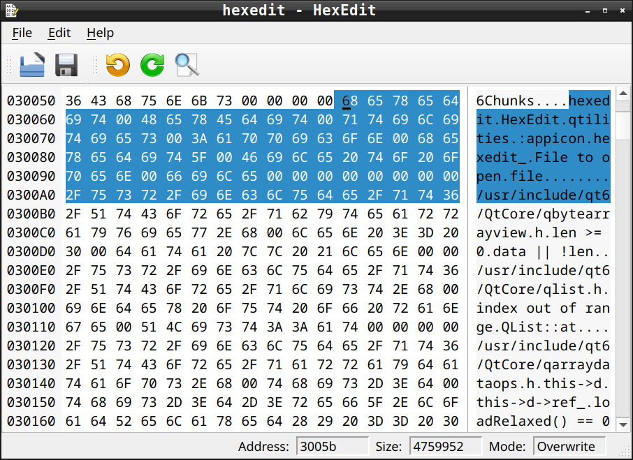

# HexEdit

HexEdit is a hex editor widget written in C++ for the Qt (5/6) framework.
It is a simple editor for binary data, just like `QPlainTextEdit` is for text data.

This project is subdivided in 3 parts:

- library: the widget is imported from a dynamic linked or static library
- application: a standalone editor using the library
- Qt Designer plugin: to create UI applications with the Qt visual editor

<!--
There are sip configuration files included,
so it is easy to create bindings for PyQt and you can use this widget also in Python.
-->
HexEdit takes the data of a `QByteArray` (`setData()`) and shows it.
You can use the mouse or the keyboard to navigate inside the widget.
If you hit the keys (0..9, a..f) you will change the data
Changed data is highlighted and can be accessed via `data()`.

Normally HexEdit works in the overwrite mode. You can set overwrite `mode(false)` and insert data.
In this case the size of `data()` increases. It is also possible to delete bytes (Del or Backspace),
here the size of data decreases.

You can select data with keyboard hits or mouse movements.
The copy-key will copy the selected data into the clipboard.
The cut-key copies also but deletes it afterwards.
In overwrite mode, the paste function overwrites the content of the (does not change the length) data.
In insert mode, clipboard data will be inserted. The clipboard content is expected in ASCII Hex notation.
Unknown characters will be ignored.

HexEdit comes with undo/redo functionality.
All changes can be undone, by pressing the undo-key (usually Ctrl-Z).
They can also be redone afterwards. The undo/redo framework is cleared,
when `setData()` sets up a new content for the editor.
You can search data inside the content with `indexOf()` and `lastIndexOf()`.
The `replace()` function is to change located subdata.
This 'replaced' data can also be undone by the undo/redo framework.

HexEdit is based on `QIODevice`, that's why HexEdit can handle big amounts of data.
The size of edited data can be more then two gigabytes without any restrictions.
<!--
## Using HexEdit

You can read the documentation of the project [here](http://qtilities.github.io/).
You find in the sources a [C++ example](https://github.com/qtilities/hexedit/tree/master/example),
that shows how tu use the HexEdit widget.
There is also a [python example](https://github.com/qtilities/hexedit/tree/master/python/python3_pyqt5) available.
-->
## Contributions

Contributions are welcome.
You can submit [issue reports], or fix them / add new features / translations via [pull requests].

## Licenses

HexEdit and Oxygen Icons, some of which are used as fallback icons, are licensed under the [LGPL-2.1] license.

The application icon is a modified version of the `hexviewer.svg` [Arcticons] icon by [Donno],
licensed under the [CC-BY-SA-4.0] license.

[issue reports]: https://github.com/qtilities/hexedit/issues
[pull requests]: https://github.com/qtilities/hexedit/pulls
[Arcticons]:     https://arcticons.onnno.nl/
[Donno]:         https://github.com/Donnnno/
[LGPL-2.1]:      COPYING
[CC-BY-SA-4.0]:  https://creativecommons.org/licenses/by-sa/4.0/?ref=chooser-v1
